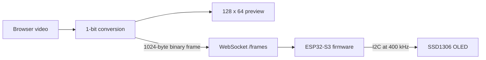

# OLED Video Player

Stream video from a browser to a 128 × 64 monochrome SSD1306 OLED connected to
an ESP32-S3. The Dioxus web UI converts each video frame into the OLED's native
1,024-byte page format, previews the result, and sends it to the firmware over a
persistent WebSocket connection.

## Showcase

https://github.com/user-attachments/assets/a2fac6cd-bec7-4025-9c53-d2be58fe8134

## How it works



The UI samples the selected video, scales and adjusts it, applies threshold,
line-art, or Bayer conversion, and packs the result into eight vertical pages.
Each X coordinate occupies one byte per page:

```text
byte_index = (y / 8) * 128 + x
bit        = y % 8
frame size = 128 * 64 / 8 = 1024 bytes
```

Video streaming uses unfragmented binary messages at `ws://<device-ip>/frames`.
The firmware validates that every message is exactly 1,024 bytes before drawing
and flushing it to the OLED. The UI allows a target rate of up to 30 FPS.

The white, black, and checkerboard test buttons still use `POST /frame`. The
firmware also exposes `GET /health`.

## Repository modules

### `ui/`

A Dioxus 0.7 web application compiled to WebAssembly.

- Loads local video files in the browser.
- Provides scale, zoom, pan, threshold, contrast, gamma, inversion, and dither
  controls.
- Shows the source video and converted OLED preview.
- Applies beam-splitter Y compensation only to the transmitted frame; it does
  not flip the preview.
- Streams raw frames through one persistent WebSocket connection.

Most UI behavior and conversion code currently lives in `ui/src/main.rs`.
Presentation styles are in `ui/assets/main.css`.

### `esp32-firmware/`

Rust firmware built with ESP-IDF:

- `src/main.rs` initializes the ESP32-S3 peripherals, OLED, HTTP server, and
  WebSocket frame endpoint.
- `src/wifi.rs` joins the configured WPA2 network and reports the assigned IP.
- `src/frame.rs` defines the 128 × 64 frame layout and startup checkerboard.
- `src/oled.rs` decodes page-packed frame bytes into SSD1306 pixels.
- `build.rs` loads `WIFI_SSID` and `WIFI_PASS` from the repository-level `.env`.
- `sdkconfig.defaults` enables WebSocket support and configures task stacks.
- `partitions.csv` defines the flash layout used when flashing.

The OLED uses I2C0 at 400 kHz with SDA on GPIO8 and SCL on GPIO9.

### `shared/`

A small protocol crate containing the display dimensions, frame size, packet
identifiers, and frame-length validation. It is the intended home for values
shared across clients and firmware.

The firmware still has local frame constants in `src/frame.rs`, so `shared/` is
not yet the sole source of truth.

### `media/`

Additional source and processed video samples used while testing monochrome
conversion.

## Flash partition table

Enabling the ESP-IDF WebSocket server increased the release image slightly past
the default 1 MiB application partition. The board has 16 MiB of flash, so
`esp32-firmware/partitions.csv` allocates a 3 MiB factory application partition:

| Partition | Offset | Size | Purpose |
| --- | ---: | ---: | --- |
| `nvs` | `0x9000` | 24 KiB | Persistent ESP-IDF and Wi-Fi data |
| `phy_init` | `0xf000` | 4 KiB | Radio PHY initialization data |
| `factory` | `0x10000` | 3 MiB | Firmware application |

This is a simple USB-flashed development layout. It does not include OTA update
slots or a filesystem partition.

The partition CSV is supplied to `espflash` when flashing. It is intentionally
not configured through `sdkconfig.defaults`, because `esp-idf-sys` builds its C
project in an intermediate directory.

## Requirements

- ESP32-S3
- 128 × 64 SSD1306 OLED
- Rust ESP toolchain and `cargo-espflash`
- Dioxus CLI (`dx`) for the web UI
- A 2.4 GHz Wi-Fi network reachable from the browser

## Configuration

Create `.env` in the repository root:

```dotenv
WIFI_SSID=your-network
WIFI_PASS=your-password
```

The file is ignored by Git.

## Build and flash the firmware

Enter the development shell and flash through the configured Cargo runner:

```bash
nix-shell
cd esp32-firmware
cargo run --release
```

The runner passes `partitions.csv` to `espflash` and opens the serial monitor.
The equivalent explicit command is:

```bash
cargo espflash flash --release --monitor \
  --partition-table partitions.csv
```

After startup, note the ESP32 IP address printed by the serial monitor.

## Run the web UI

In another terminal:

```bash
cd ui
dx serve
```

Open the URL printed by Dioxus, enter the ESP32 IP address, and use a test-frame
button to verify connectivity. Then select [`demo.mp4`](./demo.mp4), adjust the
conversion settings if needed, and start streaming.

## Credits
Player: Based on this [esp-video-display](https://github.com/younes-makhchan/ESP32_Video_Display/tree/master)  
Web-ui: Based on this [esp-video-converter](https://github.com/weblow-git/ESP32-video-converter)

